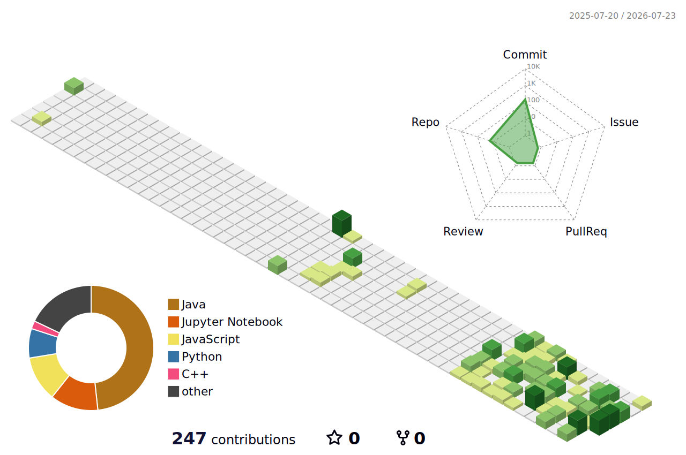

  

  <h3>Backend-Focused Java Developer | Spring Boot | React.js</h3>

  

    
    
    
  

---

### 💫 About Me

I am a Computer Science student at **National Institute of Technology (NIT), Rourkela**, and a passionate, results-driven Software Developer specializing in building scalable, and secure backend systems using **Java** and **Spring Boot**, while also writing frontend with **React.js**.

- 🔭 **I’m currently working on:** Building projects in AI, CNN, and Computer Vision (CV), along with full-stack web applications.
- 🌱 **I’m currently learning:** Spring AI.
- 💬 **Ask me about:** Java, Spring Framework, RESTful API design, Database Optimization, and React.
- 📫 **How to reach me:** [patrasoham2006@gmail.com](mailto:patrasoham2006@gmail.com)

---

### 🛠️ Tech Stack & Tooling

<table align="center" width="100%">
  <tr>
    <td align="center" width="25%" valign="top">
      <strong>Languages</strong>
        
      
      
      
       
      
      
    </td>
    <td align="center" width="25%" valign="top">
      <strong>Frontend</strong>
        
      
      
       
      
      
    </td>
    <td align="center" width="25%" valign="top">
      <strong>Backend & Databases</strong>
        
      
      
      
       
      
      
      
    </td>
    <td align="center" width="25%" valign="top">
      <strong>Security & Tools</strong>
        
      
      
      
       
      
      
      
       
      
      
    </td>
  </tr>
</table>

---

### 📊 3D Contribution Calendar

  

